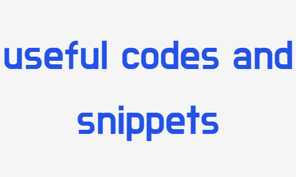

# **Useful Codes and Scripts**

Welcome to the **"Useful Codes and Scripts"** repository! This repository is a collection of helpful `codes` and `scripts` in various programming [languages](#languages), contributed by the community. 
The goal is to provide a centralized place where developers can find and share useful code snippets and scripts to aid in their projects.

## Table of Contents

- [Getting Started](#getting-started)
- [Contributing](#contributing)
- [Code Categories](#code-categories)
- [License](#license)

## Getting Started

To get started with this repository, simply browse through the available codes and scripts. You can navigate to the specific language directory to find code snippets related to that language. If you find a code snippet that you want to use, feel free to copy and integrate it into your own projects.

Each stack i.e Android, Web, Machine Learning, etc. has its own directory. You can find the code snippets and scripts related to that stack in the respective directory split into different languages further. If you have a code snippet or script that you would like to contribute, please follow the guidelines outlined in the [CONTRIBUTING.md](Contributing Guide) to contribute to this repository.

## Contributing

We encourage and welcome contributions from the community! If you have a useful code snippet or script that you would like to share, please follow the guidelines outlined in [CONTRIBUTING.md](Contributing Guide) to contribute to this repository.

## Code Categories

The repository is organized into different directories based on tech stacks and inside each stack find the language you are looking for. Here are some of the main categories:
 \
 \
 \ 
\
\

Feel free to explore the directories to find code snippets in your preferred language.

## License

The code snippets and scripts in this repository are licensed under the [MIT License](LICENSE). By contributing to this repository, you agree to license your contributions under the same license.

>Happy coding! <3
