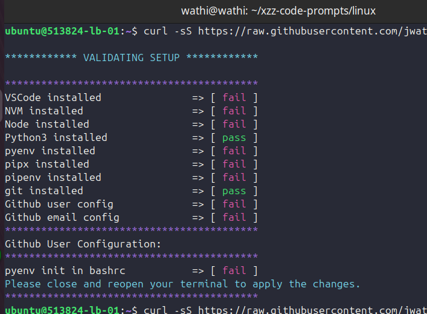

## Useful for first time setup of your PC

**ONLY TESTED IN LINUX/DEBIAN ENVIRONMENT**

This script automates the installation and verification of the requirements for getting started in your coding journey.
It installs necessary packages like git, pyenv/pipenv/pipx, npm, and nodejs, and then verifies the installation of these packages.

# Usage

To use the setup script, run the following command in your terminal:

```
curl -sS https://raw.githubusercontent.com/jwathika/xzz-code-prompts/master/linux/setup.sh | bash 2> /dev/null
```

To run tests:

```
curl -sS https://raw.githubusercontent.com/jwathika/xzz-code-prompts/master/linux/test.sh | bash 2> /dev/null
```
Sample video and pics:


Watch here => [video link](https://streamable.com/v4lqij)
# Features

Installs:

- [x] curl
- [x] git
- [x] pyenv/pipenv/pipx
- [x] npm
- [x] nodejs
- [ ] add more installations if need be

# Prerequisites

Make sure your system meets the following requirements:

- Unix-based operating system (Linux or macOS), will use apt package manager
- Internet connection
- sudo permissions

# Verify Installation:

`curl --version`

`git --version`

`pyenv --version`

`npm --version`

`node --version`

# Contributing

If you find any issues or have suggestions for improvements, please feel free to create a pull request or open an issue on the [Github repository](https://github.com/Nerds-Catapult/xzz-code-prompts)

# License

This project is licensed under the MIT License. See the LICENSE file for details.

# Contact

For any questions or support, please contact the maintainer via [email](wathika@wathika.tech)
